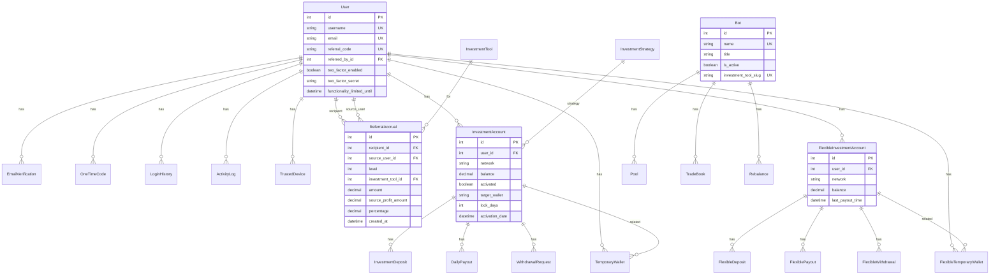

# 🗺️ Схема моделей данных

## 🎯 Core (Ядро системы)

### User (Расширенная модель пользователя)
```python
class User(AbstractUser):
    # Базовые поля Django
    username = CharField(max_length=150, unique=True)
    email = EmailField(unique=True)
    first_name = CharField(max_length=150, blank=True)
    last_name = CharField(max_length=150, blank=True)
    is_active = BooleanField(default=True)
    date_joined = DateTimeField(auto_now_add=True)
    last_login = DateTimeField(null=True, blank=True)
    
    # Кастомные поля
    language = CharField(max_length=10, default='ru')
    theme = CharField(max_length=20, default='dark')
    email_verified = BooleanField(default=False)
    marketing_optin = BooleanField(default=False)
    
    # Реферальная система
    referral_code = CharField(max_length=32, unique=True, blank=True, null=True)
    referred_by = ForeignKey('self', null=True, blank=True, on_delete=models.SET_NULL, related_name='referrals')
    
    # 2FA
    two_factor_secret = CharField(max_length=32, blank=True, null=True)
    two_factor_enabled = BooleanField(default=False)
    
    # Безопасность
    last_login_ip = GenericIPAddressField(null=True, blank=True)
    functionality_limited_until = DateTimeField(null=True, blank=True)
    
    # Методы
    def get_totp_uri(self) -> str
    def generate_2fa_secret(self) -> None
```

### EmailVerification
```python
class EmailVerification(models.Model):
    user = ForeignKey(User, on_delete=models.CASCADE)
    code = UUIDField(default=uuid.uuid4, unique=True)
    created_at = DateTimeField(auto_now_add=True)
    is_used = BooleanField(default=False)
```

### OneTimeCode
```python
class OneTimeCode(models.Model):
    user = ForeignKey(User, on_delete=models.CASCADE)
    code = CharField(max_length=16)
    created_at = DateTimeField(auto_now_add=True)
    expires_at = DateTimeField()
    is_used = BooleanField(default=False)
    purpose = CharField(max_length=50, default='2fa_reset')
```

### LoginHistory
```python
class LoginHistory(models.Model):
    user = ForeignKey(User, on_delete=models.CASCADE, related_name='login_history')
    timestamp = DateTimeField(auto_now_add=True)
    ip_address = GenericIPAddressField(null=True, blank=True)
    user_agent = TextField(null=True, blank=True)
    country = CharField(max_length=100, null=True, blank=True)
    city = CharField(max_length=100, null=True, blank=True)
    
    class Meta:
        ordering = ['-timestamp']
```

### ActivityLog
```python
class ActivityLog(models.Model):
    ACTION_TYPES = (
        ('USER_REGISTERED', 'User Registered'),
        ('USER_LOGGED_IN', 'User Logged In'),
        ('USER_LOGGED_OUT', 'User Logged Out'),
        ('PROFILE_UPDATED', 'Profile Updated'),
        ('PASSWORD_CHANGED', 'Password Changed'),
        ('EMAIL_VERIFIED', 'Email Verified'),
        ('2FA_ENABLED', '2FA Enabled'),
        ('2FA_DISABLED', '2FA Disabled'),
        ('2FA_RESET_REQUESTED', '2FA Reset Requested'),
        ('2FA_RESET_COMPLETED', '2FA Reset Completed'),
    )
    
    user = ForeignKey(User, on_delete=models.SET_NULL, null=True, blank=True, related_name='activity_logs')
    timestamp = DateTimeField(auto_now_add=True)
    action_type = CharField(max_length=50, choices=ACTION_TYPES)
    details = JSONField(null=True, blank=True)
    ip_address = GenericIPAddressField(null=True, blank=True)
    
    class Meta:
        ordering = ['-timestamp']
```

### TrustedDevice
```python
class TrustedDevice(models.Model):
    user = ForeignKey(User, on_delete=models.CASCADE, related_name='trusted_devices')
    device_token_hash = CharField(max_length=64, unique=True, null=True, blank=True, db_index=True)
    user_agent = TextField(blank=True, null=True)
    ip_address = GenericIPAddressField(null=True, blank=True)
    added_at = DateTimeField(auto_now_add=True)
    last_login_at = DateTimeField(null=True, blank=True)
    
    def set_new_token(self) -> str
```

### InvestmentStrategy
```python
class InvestmentStrategy(models.Model):
    name = CharField(max_length=100, unique=True)
    strategy_key = CharField(max_length=50, unique=True, db_index=True)
    api_prefix = CharField(max_length=100, unique=True)
    redis_channel = CharField(max_length=100, unique=True, blank=True, null=True)
    is_active = BooleanField(default=True)
```

## 🎁 Referrals (Реферальная система)

### InvestmentTool
```python
class InvestmentTool(models.Model):
    name = CharField(max_length=100, unique=True)
    strategy_key = CharField(max_length=50, unique=True, db_index=True)
    is_active = BooleanField(default=True)
```

### ReferralAccrual
```python
class ReferralAccrual(models.Model):
    recipient = ForeignKey(User, on_delete=models.CASCADE, related_name='referral_bonuses')
    source_user = ForeignKey(User, on_delete=models.CASCADE, related_name='generated_referral_income')
    level = PositiveSmallIntegerField(choices=[(1, 'Level 1'), (2, 'Level 2')])
    investment_tool = ForeignKey(InvestmentTool, on_delete=models.PROTECT)
    amount = DecimalField(max_digits=20, decimal_places=8)
    source_profit_amount = DecimalField(max_digits=20, decimal_places=8)
    percentage = DecimalField(max_digits=5, decimal_places=4)
    created_at = DateTimeField(auto_now_add=True)
    
    class Meta:
        ordering = ['-created_at']
        indexes = [
            models.Index(fields=['recipient', 'created_at']),
        ]
```

## 📈 Cross Arbitrage

### InvestmentAccount
```python
class InvestmentAccount(models.Model):
    user = ForeignKey(User, on_delete=models.CASCADE, related_name='investment_accounts_cross_arbitrage')
    network = CharField(max_length=50, choices=NETWORK_CHOICES, default='TRC20')
    balance = DecimalField(max_digits=20, decimal_places=6, default=Decimal('0.000000'))
    activated = BooleanField(default=False)
    target_wallet = CharField(max_length=128, blank=True, null=True)
    target_wallet_network = CharField(max_length=50, choices=NETWORK_CHOICES, blank=True, null=True)
    lock_days = IntegerField(default=30)
    activation_date = DateTimeField(blank=True, null=True)
    
    def is_locked(self) -> bool
    
    class Meta:
        unique_together = ('user', 'network')
```

### TemporaryWallet
```python
class TemporaryWallet(models.Model):
    STATUS_CHOICES = [
        ('pending_generation', 'Ожидает генерации'),
        ('pending_deposit', 'Ожидает депозита'),
        ('deposit_detected', 'Депозит обнаружен'),
        ('sweep_initiated', 'Свип инициирован'),
        ('sweep_success', 'Свип успешен'),
        ('sweep_failed', 'Ошибка свипа'),
        ('expired', 'Просрочен'),
        ('error', 'Ошибка'),
    ]
    
    user = ForeignKey(User, on_delete=models.CASCADE, related_name='temp_wallets_cross_arbitrage')
    address = CharField(max_length=128, unique=True, db_index=True)
    encrypted_private_key = TextField()
    network = CharField(max_length=20, choices=NETWORK_CHOICES, db_index=True)
    status = CharField(max_length=30, choices=STATUS_CHOICES, default='pending_generation', db_index=True)
    deposit_tx_hash = CharField(max_length=256, blank=True, null=True)
    detected_amount = DecimalField(max_digits=20, decimal_places=6, null=True, blank=True)
    sweep_preparation_tx_hash = CharField(max_length=256, blank=True, null=True)
    sweep_tx_hash = CharField(max_length=256, blank=True, null=True)
    error_message = TextField(blank=True, null=True)
    created_at = DateTimeField(auto_now_add=True)
    updated_at = DateTimeField(auto_now=True)
    expires_at = DateTimeField(blank=True, null=True, db_index=True)
```

### DailyPayout
```python
class DailyPayout(models.Model):
    account = ForeignKey(InvestmentAccount, on_delete=models.CASCADE, related_name='daily_payouts_cross_arbitrage')
    date = DateField()
    amount = DecimalField(max_digits=20, decimal_places=6)
    tx_hash = CharField(max_length=256, blank=True, null=True)
    success = BooleanField(default=False)
    
    class Meta:
        unique_together = ('account', 'date')
        ordering = ['-date']
```

### WithdrawalRequest
```python
class WithdrawalRequest(models.Model):
    STATUS_CHOICES = [
        ('pending', 'Pending'),
        ('processing', 'Processing'),
        ('success', 'Success'),
        ('failed', 'Failed'),
        ('cancelled', 'Cancelled'),
    ]
    
    id = UUIDField(primary_key=True, default=uuid.uuid4, editable=False)
    account = ForeignKey(InvestmentAccount, on_delete=models.CASCADE, related_name='withdrawal_requests')
    amount = DecimalField(max_digits=18, decimal_places=6)
    network = CharField(max_length=20, choices=NETWORK_CHOICES, blank=True, null=True)
    target_wallet = CharField(max_length=128, blank=True, null=True)
    status = CharField(max_length=20, choices=STATUS_CHOICES, default='pending', db_index=True)
    tx_hash = CharField(max_length=256, blank=True, null=True, unique=True, db_index=True)
    error_message = TextField(blank=True, null=True)
    requested_at = DateTimeField(auto_now_add=True, editable=False)
    processed_at = DateTimeField(blank=True, null=True, editable=False)
    
    class Meta:
        ordering = ['-requested_at']
```

## 🔄 Flexible Arbitrage

### FlexibleInvestmentAccount
```python
class FlexibleInvestmentAccount(models.Model):
    user = ForeignKey(User, on_delete=models.CASCADE, related_name='flexible_investment_accounts')
    network = CharField(max_length=50, choices=NETWORK_CHOICES)
    balance = DecimalField(max_digits=18, decimal_places=8, default=Decimal('0.0'))
    last_payout_time = DateTimeField(default=timezone.now)
    created_at = DateTimeField(auto_now_add=True)
    updated_at = DateTimeField(auto_now=True)
    
    class Meta:
        unique_together = ('user', 'network')
```

### FlexibleTemporaryWallet
```python
class FlexibleTemporaryWallet(models.Model):
    STATUS_CHOICES = [
        ('pending_generation', 'Ожидает генерации'),
        ('pending_deposit', 'Ожидает депозита'),
        ('deposit_received', 'Депозит получен'),
        ('sweep_initiated', 'Свип инициирован'),
        ('sweep_success', 'Свип успешен'),
        ('sweep_failed', 'Свип неуспешен'),
        ('error', 'Ошибка обработки'),
    ]
    
    user = ForeignKey(User, on_delete=models.CASCADE, related_name='flexible_temp_wallets')
    network = CharField(max_length=50, choices=NETWORK_CHOICES)
    address = CharField(max_length=255, unique=True, null=True, blank=True, db_index=True)
    encrypted_private_key = TextField(null=True, blank=True)
    detected_amount = DecimalField(max_digits=18, decimal_places=8, null=True, blank=True)
    status = CharField(max_length=32, choices=STATUS_CHOICES, default='pending_generation', db_index=True)
    created_at = DateTimeField(auto_now_add=True)
    updated_at = DateTimeField(auto_now=True)
    expires_at = DateTimeField(null=True, blank=True)
    sweep_tx_id = CharField(max_length=255, blank=True, null=True, db_index=True)
    error_message = TextField(blank=True, null=True)
```

### FlexiblePayout
```python
class FlexiblePayout(models.Model):
    account = ForeignKey(FlexibleInvestmentAccount, on_delete=models.CASCADE, related_name='payouts')
    amount = DecimalField(max_digits=18, decimal_places=8)
    timestamp = DateTimeField(auto_now_add=True)
    
    class Meta:
        ordering = ['-timestamp']
```

## 🤖 Bot Gateway

### Bot
```python
class Bot(models.Model):
    name = CharField(max_length=100, unique=True)
    title = CharField(max_length=255)
    is_active = BooleanField(default=False)
    investment_tool_slug = CharField(max_length=100, unique=True)
    
    class Meta:
        ordering = ['title']
```

### Pool
```python
class Pool(models.Model):
    bot = ForeignKey(Bot, on_delete=models.CASCADE, related_name='pools')
    exchange = CharField(max_length=100)
    coin_name = CharField(max_length=50)
    balance = DecimalField(max_digits=20, decimal_places=8)
    last_updated = DateTimeField(auto_now=True)
    
    class Meta:
        unique_together = ('bot', 'exchange', 'coin_name')
```

### TradeBook
```python
class TradeBook(models.Model):
    bot = ForeignKey(Bot, on_delete=models.CASCADE, related_name='trades')
    exchange = CharField(max_length=100)
    coin_name = CharField(max_length=50)
    side = CharField(max_length=4, choices=[('BUY', 'Buy'), ('SELL', 'Sell')])
    quantity = DecimalField(max_digits=20, decimal_places=8)
    price = DecimalField(max_digits=20, decimal_places=8)
    total = DecimalField(max_digits=20, decimal_places=8)
    profit = DecimalField(max_digits=20, decimal_places=8, null=True, blank=True)
    timestamp = DateTimeField(auto_now_add=True, db_index=True)
    
    class Meta:
        ordering = ['-timestamp']
```

### MarketSummary
```python
class MarketSummary(models.Model):
    total_market_cap = DecimalField(max_digits=30, decimal_places=2)
    total_volume_24h = DecimalField(max_digits=30, decimal_places=2)
    btc_dominance = DecimalField(max_digits=5, decimal_places=2)
    eth_dominance = DecimalField(max_digits=5, decimal_places=2)
    market_cap_change_24h = DecimalField(max_digits=6, decimal_places=2)
    updated_at = DateTimeField(auto_now=True)
```

### TrendingCoin
```python
class TrendingCoin(models.Model):
    coingecko_id = CharField(max_length=100, unique=True, db_index=True)
    symbol = CharField(max_length=20)
    name = CharField(max_length=100)
    price = DecimalField(max_digits=20, decimal_places=8)
    market_cap = BigIntegerField()
    volume_24h = BigIntegerField()
    price_change_24h = FloatField()
    image_url = URLField()
    updated_at = DateTimeField(auto_now=True)
    
    class Meta:
        ordering = ['-market_cap']
```

## 🧠 SMC Settings

### CmcFilterSettings
```python
class CmcFilterSettings(models.Model):
    name = CharField(max_length=64, default="Default")
    min_volume_24h = DecimalField(max_digits=20, decimal_places=2, default=30000000)
    min_market_cap = DecimalField(max_digits=20, decimal_places=2, default=300000000)
    min_market_pairs = IntegerField(default=20)
    min_age_days = IntegerField(default=90)
    max_7d_change = DecimalField(max_digits=6, decimal_places=2, default=30)
    min_rank = IntegerField(default=1)
    max_rank = IntegerField(default=150)
    blacklist = TextField(default="")
    excluded_tags = TextField(default="")
```

### SmartMoneyStrategySettings
```python
class SmartMoneyStrategySettings(models.Model):
    name = CharField(max_length=64, default="Default")
    min_open_interest_usd = DecimalField(max_digits=20, decimal_places=2, default=5000000)
    min_liquidations_usd = DecimalField(max_digits=20, decimal_places=2, default=1000000)
    extreme_funding_threshold = DecimalField(max_digits=6, decimal_places=4, default=0.01)
    liquidation_bias_ratio = DecimalField(max_digits=5, decimal_places=2, default=1.5)
    taker_volume_ratio_threshold = DecimalField(max_digits=5, decimal_places=2, default=1.2)
    entry_deviation_percent = DecimalField(max_digits=5, decimal_places=2, default=1.0)
    tp_ratio = DecimalField(max_digits=5, decimal_places=2, default=3.0)
    sl_ratio = DecimalField(max_digits=5, decimal_places=2, default=1.5)
    enabled = BooleanField(default=True)
```

## 📊 ERD Схема связей



---

**Связанные документы:**
- [BACKEND_OVERVIEW.md](./BACKEND_OVERVIEW.md) - обзор архитектуры
- [API_ENDPOINTS.md](./API_ENDPOINTS.md) - полный список эндпоинтов
- [SECURITY_NOTES.md](./SECURITY_NOTES.md) - политика безопасности
